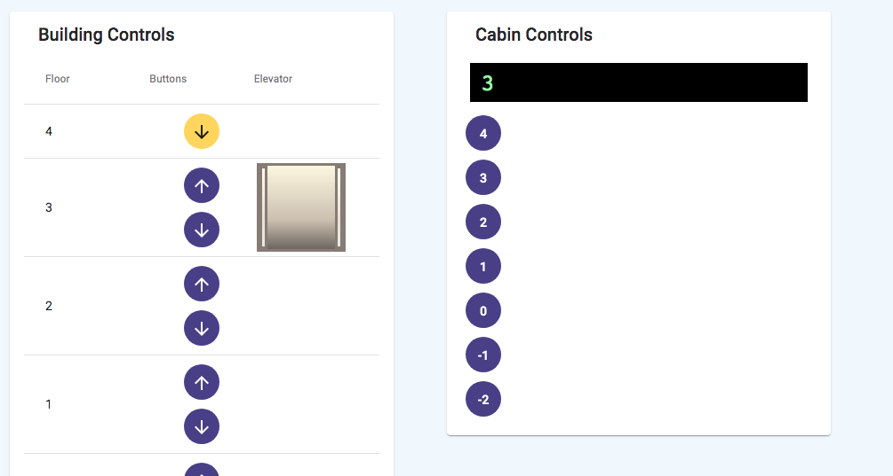

# Elevator

This project is a simple implementation of an elevator control including a UI to play with it.
It was started to experiment with Angular 10, Jest testing framework and to find out how complex an elevator control actually is.

It features:

- Cabin and floor controls in a building
- Variable number of levels in a building
- You can request the elevator to pick you up and get in the selected direction
- You can directly go to a level from the cabin
- Both floor and cabin requests are processed in a prioritized way
- When your floor request is on the way to the cabins target level, it will pick you up
- Displaying the current floor in the cabin
- Displaying if buttons are pushed until the request has been processed.

Note: This is not meant to be used to actually build a functioning elevator.

This project was generated with [Angular CLI](https://github.com/angular/angular-cli) version 10.0.0.

## Development server

Run `ng serve` for a dev server. Navigate to `http://localhost:4200/`. The app will automatically reload if you change any of the source files.

## Build

Run `ng build` to build the project. The build artifacts will be stored in the `dist/` directory. Use the `--prod` flag for a production build.

## Running unit tests

Run `npm test` to execute the unit tests via Jest.

## Running end-to-end tests

Run `ng e2e` to execute the end-to-end tests via [Protractor](http://www.protractortest.org/).

## Further help

To get more help on the Angular CLI use `ng help` or go check out the [Angular CLI README](https://github.com/angular/angular-cli/blob/master/README.md).
